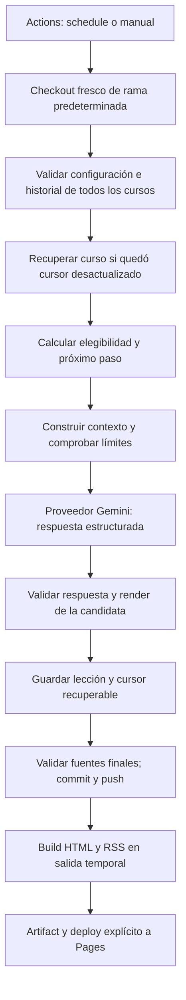

# Arquitectura mínima propuesta

Contratos: [modelo de datos](data-model.md). Operación durable: [operations.md](operations.md). Avance automático confirmado en Q-001; no hay confirmaciones del alumno.

## Responsabilidades

| Área | Responsabilidad | Límite |
|---|---|---|
| `courses` | Discovery, parsing, validación de referencias y carga del historial | No invoca Gemini ni publica |
| `planning` | Elegibilidad por fecha y siguiente paso desde fuentes validadas | Funciones deterministas con reloj recibido; sin API ni escrituras |
| `generation` | Contexto, prompt versionado, contrato de proveedor y validación de respuesta | No decide avance educativo ni escribe archivos |
| `storage` | Locks, staging, instalación de lección y actualización/recuperación de cursor | No conoce RSS ni contiene prompts |
| `publishing` | Renderer Markdown compartido, HTML, RSS y salida temporal de build | Sólo lee fuentes; sin API ni mutaciones de progreso |
| `cli` | Orquestación de comandos y reportes | Sin duplicar reglas del dominio |

Un proveedor Gemini real y uno simulado para pruebas implementan el mismo contrato. No se crean repositorios abstractos, buses, registries de plugins ni interfaces para cada helper. Sólo se aíslan los límites con efectos: proveedor, reloj y filesystem cuando una prueba lo necesite.

Se propone un único proceso Node.js sin servidor. Los paquetes de parsing, Markdown, saneamiento y XML se seleccionarán y comprobarán al implementar. Se usará una versión LTS de Node compatible con el SDK seleccionado y un lockfile; aún no hay versiones instaladas.

## Flujo de generación



El lote valida todo antes de consumir API. Desde v0.9, planifica las fechas pendientes de cada curso en orden y las intercala entre cursos hasta `maxLessonsPerRun`, para que un atraso grande no monopolice el run. Un fallo de proveedor bloquea fechas posteriores de ese curso durante el run, pero permite conservar y desplegar éxitos de los demás; el resultado global se marca como fallo parcial.

## Siguiente lección: algoritmo determinista

Para un curso activo, con lock adquirido y fuentes coherentes:

1. Leer la lista ordenada `steps` y localizar `progress.startStepId`.
2. Ordenar lecciones por `sequence`. Verificar secuencia consecutiva, IDs, fechas de generación únicas y pasos iguales al prefijo consecutivo del syllabus desde el inicio elegido.
3. Si no hay lecciones, seleccionar `startStepId`; si hay, seleccionar el paso inmediatamente posterior al de la última lección. Si no existe, devolver `exhausted`.
4. Derivar el cursor esperado y comprobarlo contra `progress.cursor`. Un desfase reparable se resuelve antes de cualquier llamada. Un historial con huecos o conflicto se detiene.
5. Comprobar status, tipo de ejecución, calendario y ausencia de lección en la fecha local de operación.
6. Asignar `sequence = número de lecciones + 1` y ruta derivada de sequence/stepId. La IA recibe el paso ya decidido y no puede elegir otro.

Ejemplo: con pasos PCM → muestreo → profundidad de bits y una lección aceptada de PCM, el siguiente siempre es muestreo. Con el último paso publicado, el motor omite. Para profundizar muestreo en dos lecciones, se definen previamente dos pasos con distinto ID y el mismo topicId.

La determinación del paso es reproducible; la redacción de la IA no se promete idéntica entre llamadas. Cambiar el título de una lección no cambia su identidad ni ruta.

## Generación educativa y materiales

Cada curso configura audiencia e instrucciones. Audio digital pide profundidad y verificación práctica; Full Stack ubica la lección en una unidad y desarrolla una práctica concreta; Música clásica mantiene pocas obras, explica términos y da indicaciones de escucha. Estas reglas viven en datos del curso, nunca en `if (slug === ...)` dentro del motor.

Los roadmaps y fuentes externas se revisan y traducen al syllabus local. El MVP no descarga ni ejecuta automáticamente material remoto. El modelo recibe referencias locales, pero el motor no certifica que una grabación o enlace siga disponible.

El RSS contiene la lección completa: no es necesario entrar en la web ni marcar prácticas o lecturas. La conversación posterior sólo produce cambios en archivos cuando el usuario pide una corrección concreta. Se modifica la lección existente y se reconstruye, sin ejecutar el planificador ni avanzar el cursor por esa corrección.

## Publicación

Un renderer Markdown produce HTML seguro para web y RSS. Las páginas usan plantillas pequeñas, navegación por curso y anterior/siguiente; no requieren JavaScript del cliente. El sitio muestra todos los cursos, incluidos los pausados, con su estado editorial.

RSS 2.0: `/feed.xml` y `/<course>/feed.xml` relativos a `baseUrl`. Cada item usa GUID `urn:uuid:<lesson.id>` con `isPermaLink=false`, enlace canónico, `pubDate` desde `publishedAt`, título y `description` con HTML completo saneado. No se recorta contenido a un resumen. Feed global y por curso reutilizan exactamente la misma identidad.

Se incluyen todas las lecciones en el MVP, ordenadas por `publishedAt` descendente y, en empate, course/sequence. Cada canal contiene título, enlace a su portada y descripción. Las fechas de items se convierten del UTC del frontmatter al formato de fecha RSS con año de cuatro dígitos y zona GMT. Las fechas del canal, si se incluyen, se derivan del contenido, no del reloj del build; se omiten en canales vacíos. Los feeds vacíos son válidos; pausar no vacía un feed. `feed: false` excluye lecciones de ese curso de ambos tipos de feed.

## Estructura definitiva propuesta

Sólo `.spec/` se crea en esta etapa; el resto representa la implementación futura.

```text
rss-lecciones/
├── .spec/lecciones-rss/       # estos documentos
├── site.yml                  # URL pública y límites generales; sin secretos
├── courses/
│   └── <slug>/
│       ├── course.yml
│       ├── syllabus.md
│       ├── progress.json
│       └── lessons/*.md
├── src/
│   ├── courses/
│   ├── planning/
│   ├── generation/
│   ├── storage/
│   ├── publishing/
│   └── cli/
├── templates/                # HTML mínimo y CSS compartido
├── tests/                    # fixtures, dominio y fallos relevantes
├── .github/workflows/
│   └── publish.yml           # schedule, dispatch y push; jobs con permisos distintos
├── .work/                    # staging y locks locales; ignorado por Git
├── dist/                     # HTML/RSS generado; ignorado por Git
├── package.json
├── package-lock.json
├── tsconfig.json
├── .gitignore
└── README.md
```

No se versiona `dist/` ni se publica `courses/` directamente. No hace falta `public/` como segunda copia del contenido. El deploy sólo recibe `dist/`. La configuración, fuentes y progreso sí se versionan. Agregar un curso exige datos válidos, no recompilar una lista central; puede requerir ajustar el límite global de llamadas.

## Comandos propuestos

| Comando | Comportamiento |
|---|---|
| `npm run validate` | Comprueba sitio, cursos, syllabus, lecciones y cursor; no escribe ni usa API |
| `npm run lesson -- audio-digital` | Despacha el workflow remoto para ese curso mediante GitHub CLI autenticada; informa enlace de ejecución, no éxito de generación |
| `npm run generate -- --course audio-digital` | Comando interno del runner de Actions, con Secret inyectado; genera próxima lección manual |
| `npm run generate -- --scheduled` | Comando interno de Actions; selecciona cursos del día |
| `npm run recover -- audio-digital` | Repara sólo cursor derivado bajo lock, con fuentes válidas; no usa API |
| `npm run feeds` | Recalcula XML local sin tocar fuentes; no hace deploy |
| `npm run build` | Construye sitio y feeds completos desde cero; sin API |

La CLI de dispatch requiere repo remoto configurado, workflow en la rama predeterminada y GitHub CLI disponible/autenticada. Generar manualmente también puede hacerse desde la UI de Actions sin esa CLI. No hay generación local real con una clave copiada fuera de Secrets en este diseño.
